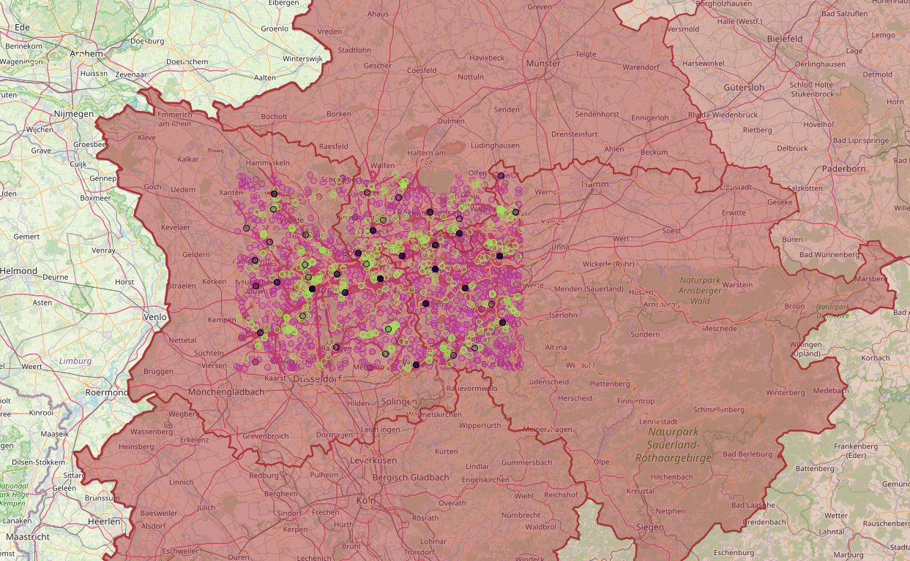

## Coypu Data

```sparql
PREFIX geof: <http://www.opengis.net/def/function/geosparql/>
PREFIX spatial: <http://jena.apache.org/spatial#>
PREFIX geo: <http://www.opengis.net/ont/geosparql#>

SELECT ?g ?xx ?xxColor {
  VALUES ?p {
    #"POLYGON ((8.023705352832053 49.25243085997815, 8.023705352832053 48.64116334084815, 8.820551487215312 48.64116334084815, 8.820551487215312 49.25243085997815, 8.023705352832053 49.25243085997815))"^^geo:wktLiteral
    #"POLYGON ((6.536425 51.282535, 6.536425 51.665741, 7.420708 51.665741, 7.420708 51.282535, 6.536425 51.282535))"^^geo:wktLiteral
    "POLYGON ((6.475457372470345 51.7037981703763, 6.475457372470346 51.2481032780451, 7.544268491722988 51.24810327804511, 7.544268491722988 51.70379817037631, 6.475457372470345 51.7037981703763))"^^geo:wktLiteral
  }
  lateral {
    graph ?g { ?x spatial:intersectBoxGeom(?p) . ?x geo:hasGeometry/geo:asWKT ?xx . FILTER(geof:sfIntersects(?xx, ?p)) }
    bind (concat('#', substr(md5(str(?g)), 1, 6)) AS ?xxColor)
  }
}
```



